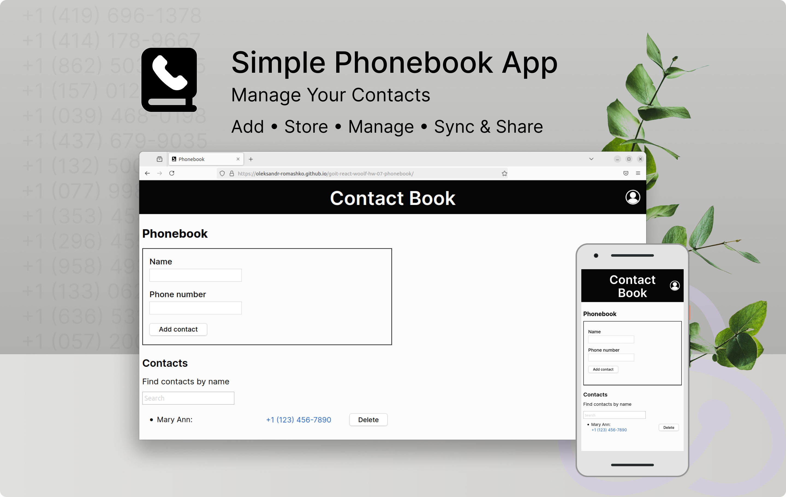
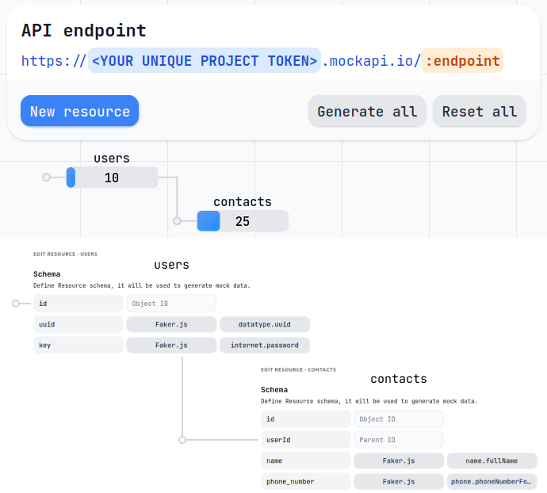

# Contact Book

<p align="center">
  
</p>

<h5 align="center">
  A simple phonebook application to store your phone contacts
</h5>


## Features

- Add new contacts
- Store contacts locally and view contact details
- Filter existing contacts
- Delete contacts

## Live page demo

The live page for this repository can be viewed at [GitHub Pages](https://oleksandr-romashko.github.io/goit-react-woolf-hw-06-phonebook/).

## Task

The main goal was to refactor [existing repository code](https://github.com/oleksandr-romashko/goit-react-woolf-hw-06-phonebook) using React, Redux Toolkit and [mockapi.io API](https://mockapi.io/).

This solution follows provided requirements. You may read more about them [here](./assets/task/README.en.md).

## Technologies Used

- React Redux
- Redux Toolkit
- Redux thunk for asynchronous requests to back-end API using axios and [mockapi.io](https://mockapi.io/) as back-end
- Styled Components

## Getting Started

### Prerequisites

- Node.js
- npm
- [mockapi.io](https://mockapi.io/) back-end set-up for the following operations:
  - `fetchContacts` - get an array of contacts (GET method) using GET request - action type `contacts/fetchAll`.
  - `addContact` - add contact (POST method) - action type `contacts/addContact`.
  - `deleteContact` - deletes a contact (DELETE method) - action type `contacts/deleteContact`.
  
  Mockapi backend should have following structure and endpoints:
  <p align="center">
    
  </p>


### Installation

1. Make sure you have an LTS version of Node.js installed on your computer. [Download and install](https://nodejs.org/en/) it if necessary.
2. Clone the repository:
    ```sh
    git clone https://github.com/oleksandr-romashko/goit-react-woolf-hw-07-phonebook.git
    ```
3. Navigate to the project directory:
    ```sh
    cd goit-react-woolf-hw-07-phonebook
    ```
4. Install the dependencies:
    ```sh
    npm install
    ```

### Running the Application

#### Locally

1. Create a `.env.local` file in the project root folder. It should contain `REACT_APP_MOCKAPI_API_SECRET` environment variable with your unique [mockapi.io](https://github.com/mockapi-io/docs/wiki/Quick-start-guide) project token as a value to access your backend. Use the [.env.example](.env.example) file as a template.
2. Start the development server in terminal: `npm start`

The application will be available at http://localhost:3000.

#### Live page

1. Add `REACT_APP_MOCKAPI_API_SECRET` repository secret with unique [mockapi.io](https://github.com/mockapi-io/docs/wiki/Quick-start-guide) project token as a value to access your backend. All environmental secrets and variables are described in [.env.example](.env.example) file.
2. Set-up your own GitHub live page, please consider following [these instructions](./assets/teplate-repository-usage/README.en.md).

