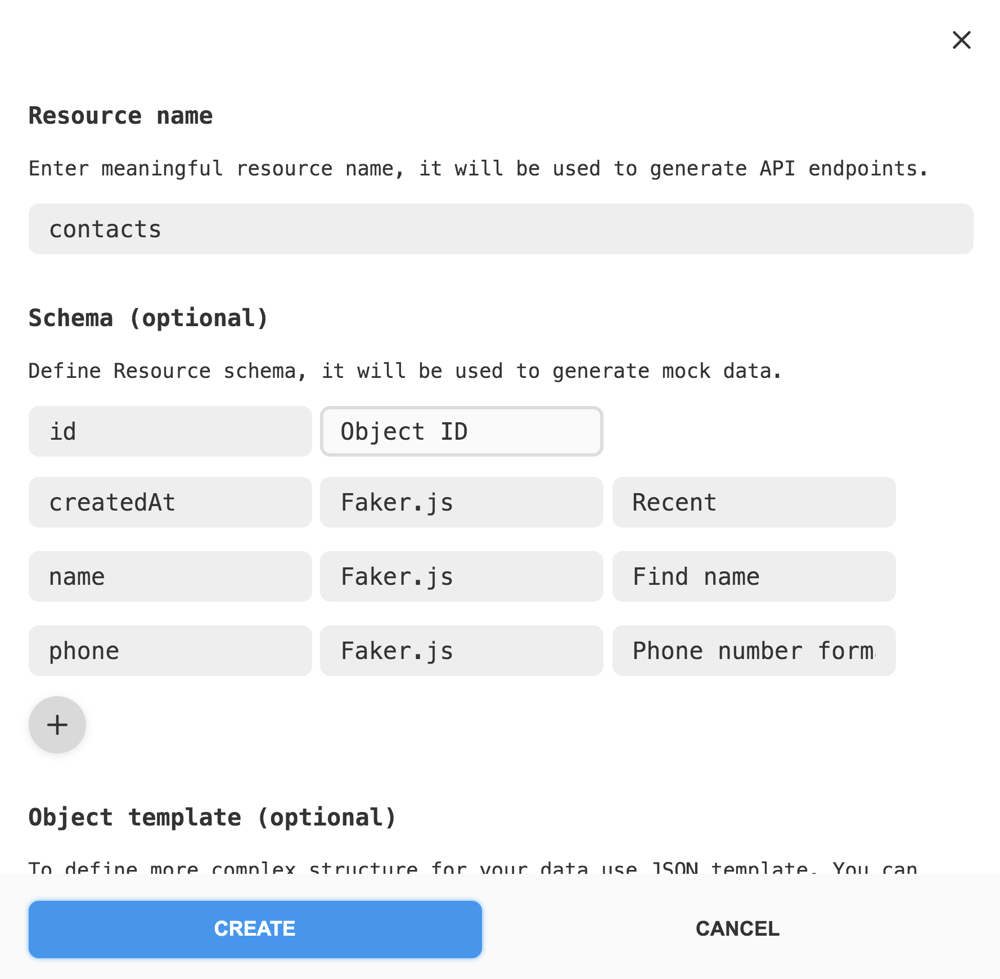

# Phonebook application 
## (using Redux Toolkit, asynch Redux Toolkit operations and mockapi.io as back-end)

## Task

Perform refactoring of the Contact Book application code. Remove the code responsible for storing and reading contacts from the local storage, and add communication with the backend for storing contacts.

## Backend

Create your own personal backend for development with the UI service [mockapi.io](https://mockapi.io/). Sign up using your GitHub account. Create a resource contacts to get your endpoint `/contacts`. Use resource constructor and describe the contact object as on the picture:

<p align="center">
  
</p>

## State Form

Add the load and error indicator handling to the Redux state. To do this, change the state form.

```json
{
contacts: {
  items: [],
  isLoading: false,
  error: null
},
  filter: ""
}
```

## Operations

Use `createAsyncThunk` to declare asynchronous action generators and make HTTP requests. Do the processing of the actions and change data in Redux state with createSlice.

Declare the following operations:

  - `fetchContacts` - get an array of contacts (GET method) using GET request - action type `contacts/fetchAll`.
  - `addContact` - add contact (POST method) - action type `contacts/addContact`.
  - `deleteContact` - deletes a contact (DELETE method) - action type `contacts/deleteContact`.

## Task Acceptance Criteria

[React project template](https://github.com/goitacademy/react-homework-template/blob/main/README.en.md) is used as an initial starting point for your application (more information about how to start-up with such a project may be found at the template repo [description](./../teplate-repository-usage/README.en.md).

  * The `goit-react-hw-07-phonebook` repository has been created.
  * Implemented using Redux Toolkit library.

Previous requirements and Acceptance Criteria that are also applied to this solution:

  * When submitting homework, there are two links: to the source files and the live page using `GitHub Pages`.
  * When visiting live page, there are no errors or warnings in the console.
  * Each component has a separate folder with a React-component file and styles.
  * Components described using `propTypes`.
  * Refactor the "[Contact Book](https://github.com/oleksandr-romashko/goit-react-woolf-hw-06-phonebook)" code by adding state control using the [Redux Toolkit library](https://redux-toolkit.js.org/). 
  * Redux-state stores the minimum required set of data.
  * Solution implemented using library `Redux Toolkit`.
  * Use `createSlice()`.
  * Create actions to save and delete a contact, and update the filter.
  * Link React-components to Redux-logic with hooks library `react-redux`.

## Solution example

A search field that you can use to filter your contacts.

<p align="center">
  
</p>

Denies the user the ability to add contacts whose names are already in the phonebook. If tries to do so, alert with a warning is printed.

<p align="center">
  
</p>

Allows the user to delete previously saved contacts.

<p align="center">
  
</p>