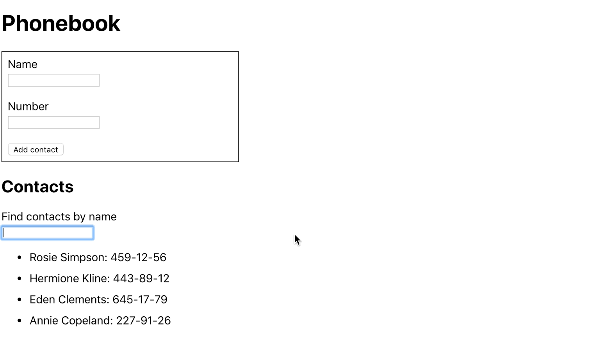

# Phonebook application (using Redux)

## Task Acceptance Criteria

[React project template](https://github.com/goitacademy/react-homework-template/blob/main/README.en.md) is used as an initial starting point for your application (more information about how to start-up with such a project may be found at the template repo [description](./../teplate-repository-usage/README.en.md). .

  * The `goit-react-hw-06-phonebook` repository has been created.
  * When submitting homework, there are two links: to the source files and the live page using `GitHub Pages`.
  * When visiting live page, there are no errors or warnings in the console.
  * Each component has a separate folder with a React-component file and styles.
  * Components described using `propTypes`.
  * Refactor the "[Contact Book](https://github.com/oleksandr-romashko/goit-react-hw-04-phonebook)" code by adding state control using the [Redux Toolkit library](https://redux-toolkit.js.org/). Let the Redux state look like this:
    ```json
    {
      contacts: [],
      filter: ""
    }
    ```
  * Redux-state stores the minimum required set of data.
  * Solution implemented using library `Redux Toolkit`.
  * Use `createSlice()`.
  * Create actions to save and delete a contact, and update the filter.
  * Link React-components to Redux-logic with hooks library `react-redux`.
  * Use the `Redux Persist` library to save an array of contacts to local storage.

## Solution example:

A search field that you can use to filter your contacts.

<p align="center">
  
</p>

Denies the user the ability to add contacts whose names are already in the phonebook. If tries to do so, alert with a warning is printed.

<p align="center">
  
</p>

Allows the user to delete previously saved contacts.

<p align="center">
  
</p>